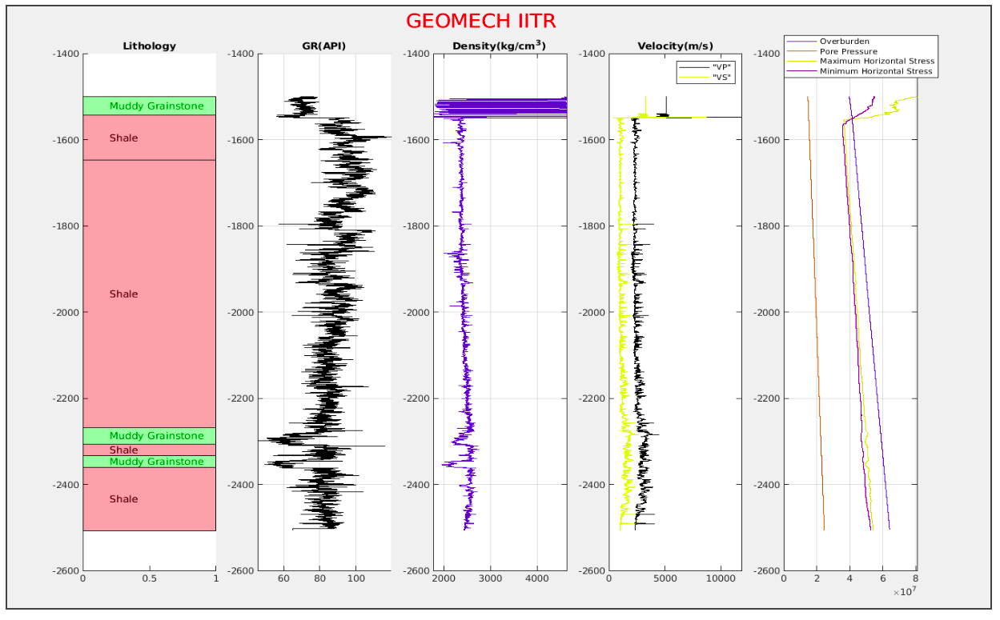

# Geomech IITR
A MATLAB tool for Standard well interpretation and Geomechanical Modelling

#### General Features  
* Simple GUI platform for well log analysis
* Visualisation of wireline Log Data: load and plot wireline log to visualise log data 
* Synthetic Log Modeler: Create any synthetic log data using our equation modeler  
* Interpret the lithology:use our create lithology file to interpret the lithology by using several logs   
* Advanced Visualisation: Create Cross Plots and Histograms
* Curve Fitting Tools: Find  linear,exponential and Power law fitting to model lab data    

#### Standard Well Log Interpretation Tools
* Inbuilt Shale Volume Calculation using different models
* Inbuilt Density and DT Porosity Calculation
* Inbuilt Synthetic Density, VP and VS modeler 
* Create Well Section/Lithology: Create lithology/well section based on different  type of formation or fluid
* Inbuilt Fluid Density/DT modeler
* Synthetic Data Modeler: create log data  based on different  lithology/well section   
* Advanced Synthetic Data Modeler: Advance Tool for modeling and create synthetic log based on any type  of  equation  varying different set of lithology/well section

#### Geomechanical Tools
* Elastic parameter and Poisson Ratio Modeling: calculate bulk and young modulus      
* UCS and Friction angle Modeler: Calculate UCS and friction angle using different equation in different lithology 
* Inbuilt Pore Pressure Estimator:Calculate overpressure zone and model pore pressure using dt or resistivity using various different method like ratio method, eaton’s method etc  
* Principal  Stress Calculator: Calculate the three stress using tectonics strain
* Fracture Pressure Estimation:  
* Stress around Wellbore and Failure Analysis  
 
 
 ## Prerequisites
 SeisLab 3.02: [Download](https://in.mathworks.com/matlabcentral/fileexchange/53109-seislab-3-02)

## Getting Started with GeoMech IITR
* Downloaded the GeoMech IITR zip file
* Extract the file.
* Start MATLAB and copy the GeoMech_IITR folder
* Paste the GeoMech_IITR folder current folder 
* Open the Folder (you will see various function of GeoMech IITR )
* Run GeoMech_IITR in Command Window  

## Authors

* **Satyam Pratap Singh** - *Initial work* - [singhsatyampratap](https://github.com/singhsatyampratap)

## License

This project is licensed under the MIT License - see the [LICENSE.md](LICENSE.md) file for details

## Acknowledgments

* I would like to thanks Dr. S.P. Pradhan for his guidance. 
* A special thanks to Kalpesh Katkade for helping me with the code.

